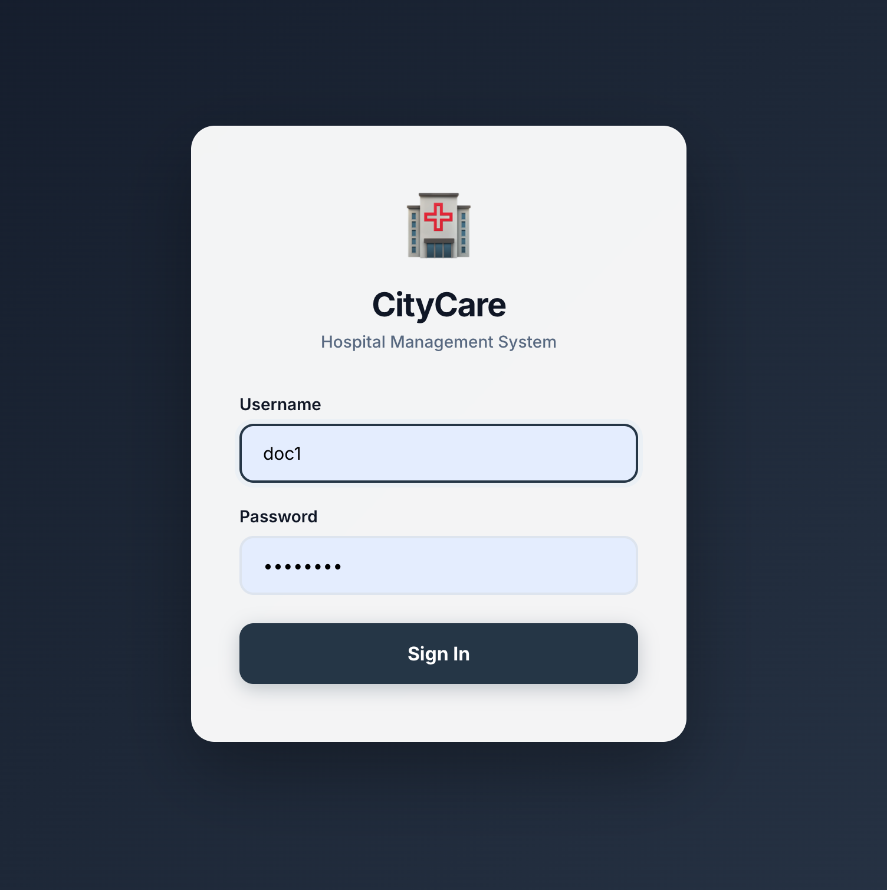
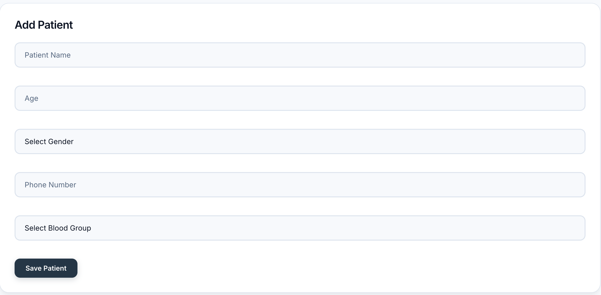

# 🏥 CityCare — Hospital Management System

A full-stack Hospital Management System built with **React** (frontend) and **Express + MySQL** (backend). The application supports two distinct user roles — **Admin** and **Doctor** — each with their own dashboard, navigation, and set of capabilities.

Admins can manage the entire hospital: view system-wide statistics, manage all doctors (add, edit, delete), and view any doctor's patients and their visit histories. Doctors can manage their own patients and visits, including recording diagnoses, prescriptions, and fees.

---

## ✨ Features

### Authentication & Roles
- Login system with JWT-based authentication
- Role-based access control (Admin / Doctor)
- Password hashing with bcrypt
- Token verification on protected routes
- Session persistence via `localStorage`

### Admin Panel
- **Admin Dashboard** — system-wide statistics (total patients, total visits, today's visits, revenue)
- **Doctor Management** — add, edit, and delete doctors with profile details (name, degree, experience, speciality, login credentials)
- **Patient Overview** — view all patients filtered by doctor
- **Patient Details (read-only)** — view any patient's details and full visit history

### Doctor Panel
- **Doctor Dashboard** — personal statistics (own patients, visits, today's visits, revenue)
- **Patient Management** — add, edit, and delete patients (name, age, gender, phone, blood group)
- **Patient Details** — view detailed patient information
- **Visit Management** — add, edit, and delete visits with date, diagnosis, prescription, and fees
- **Prescription Builder** — add multiple medicines per visit with medicine name, medium (e.g. Oral), and frequency
- **Medicine Autocomplete** — search and select from a master medicine list with option to add new medicines

### Backend / API
- RESTful Express.js API with full CRUD operations
- MySQL database with relational schema (doctors, patients, visits, prescriptions, medicine_master, admins)
- Doctor-scoped data isolation (doctors can only access their own patients)
- Admin endpoints for system-wide access
- Database migration scripts for schema setup

---

## 🛠️ Tech Stack

| Layer     | Technology                              |
| --------- | --------------------------------------- |
| Frontend  | React 19, JavaScript (JSX), CSS         |
| Routing   | React Router DOM v7                     |
| Backend   | Express.js (Node.js)                    |
| Database  | MySQL                                   |
| Auth      | JSON Web Tokens (JWT), bcrypt           |
| Bundler   | Vite                                    |
| Linting   | ESLint                                  |
| Package   | npm                                     |

---

## 📁 Project Structure

```
hospital-management/
├── backend/
│   ├── server.js              # Express API server (all routes)
│   ├── migrate.js             # Database migration (doctors, patients, medicine_master)
│   └── migrate_admin.js       # Admin migration (admins table, doctor profile columns)
├── public/
│   ├── favicon.svg            # App favicon
│   └── icons.svg              # Icon sprites
├── src/
│   ├── assets/                # Static assets (images)
│   ├── components/
│   │   ├── Sidebar.jsx        # Doctor sidebar navigation
│   │   ├── AdminSidebar.jsx   # Admin sidebar navigation
│   │   └── MedicineAutocomplete.jsx  # Autocomplete for medicine search
│   ├── data/
│   │   └── patients.js        # Sample/fallback patient data
│   ├── pages/
│   │   ├── Login.jsx          # Login page
│   │   ├── Dashboard.jsx      # Doctor dashboard (stats)
│   │   ├── Patients.jsx       # Doctor patient list (CRUD)
│   │   ├── PatientDetails.jsx # Patient details + visit management
│   │   ├── Doctors.jsx        # Placeholder doctor page
│   │   ├── AdminDashboard.jsx # Admin dashboard (system-wide stats)
│   │   ├── AdminPatients.jsx  # Admin patient view (filter by doctor)
│   │   ├── AdminPatientDetails.jsx  # Admin patient details (read-only)
│   │   └── AdminDoctors.jsx   # Admin doctor management (CRUD)
│   ├── App.jsx                # Root component with routing and auth logic
│   ├── App.css                # Application styles
│   ├── index.css              # Global styles and CSS variables
│   └── main.jsx               # React entry point
├── screenshots/               # Application screenshots
├── .env.example               # Environment variable template
├── .gitignore
├── eslint.config.js
├── index.html                 # Vite HTML entry point
├── package.json
├── package-lock.json
├── vite.config.js
└── README.md
```

---

## 📸 Screenshots

### Login Page


### Doctor Dashboard


### Admin Dashboard


### Doctor — Patients Page


### Admin — Patients Page (filtered by doctor)


### Patient Details & Visit History


### Add Patient Form


### Add Visit Form (with prescription builder)


### Admin — Doctors Page


### Add Doctor Form


---

## 🚀 Getting Started

### Prerequisites

- **Node.js** (v18 or later recommended)
- **npm** (comes with Node.js)
- **MySQL** (v8 or later recommended)

### 1. Clone the Repository

```bash
git clone https://github.com/<your-username>/hospital-management.git
cd hospital-management
```

### 2. Install Dependencies

```bash
npm install
```

### 3. Set Up the Database

1. Create a MySQL database:

```sql
CREATE DATABASE hospital_db;
```

2. Create a `.env` file in the project root (use `.env.example` as a template):

```bash
cp .env.example .env
```

3. Edit `.env` and fill in your MySQL credentials:

```
DB_HOST=localhost
DB_USER=root
DB_PASSWORD=your_password
DB_NAME=hospital_db
JWT_SECRET=your_secret_key
PORT=5001
```

> **⚠️ Important:** Before running migrations, update `backend/server.js`, `backend/migrate.js`, and `backend/migrate_admin.js` to read database credentials from environment variables instead of hardcoded values. See the [Important Warnings](#-important-warnings) section below.

4. Run the database migrations:

```bash
node backend/migrate.js
node backend/migrate_admin.js
```

This will create the required tables (`doctors`, `patients`, `visits`, `prescriptions`, `medicine_master`, `admins`) and seed default accounts.

**Default accounts created by migration:**
- **Doctor:** username `doc1`, password `Doc12345`
- **Admin:** username `ADMIN`, password `Admin123`

### 4. Start the Backend Server

```bash
node backend/server.js
```

The API server will start on `http://localhost:5001`.

### 5. Start the Frontend (in a new terminal)

```bash
npm run dev
```

The frontend will start on `http://localhost:5173` (default Vite port).

---

## ⚙️ How It Works

### Architecture

The application follows a **client-server architecture**:

- **Frontend (React + Vite):** Handles all UI rendering, navigation, and user interaction. Communicates with the backend via `fetch()` API calls to `http://localhost:5001`.
- **Backend (Express.js):** Provides a RESTful API for authentication, patient management, visit management, doctor management, and dashboard statistics.
- **Database (MySQL):** Stores all persistent data in a relational schema.

### Authentication Flow

1. User enters credentials on the Login page.
2. The backend checks the `admins` table first, then the `doctors` table.
3. Passwords are compared using bcrypt.
4. On success, a JWT token is returned and stored in `localStorage`.
5. All subsequent API requests include the token in the `Authorization` header.
6. The `App.jsx` component checks for a stored token on mount and verifies it against the `/me` endpoint.

### Role-Based Routing

- **Admin** users see the `AdminSidebar` with routes to Dashboard, Patients, and Doctors.
- **Doctor** users see the `Sidebar` with routes to Dashboard and Patients.
- The `App.jsx` component renders different route configurations based on the user's role.

### Data Flow

- Patients belong to a specific doctor (`doctor_id` foreign key).
- Visits belong to a specific patient (`patient_id` foreign key).
- Prescriptions belong to a specific visit (`visit_id` foreign key), supporting multiple medicines per visit.
- Dashboard statistics are computed via SQL aggregate queries.
- Admin endpoints access data across all doctors; doctor endpoints are scoped to the authenticated doctor.

### Database Schema

```
doctors       → id, username, password, name, degree, experience, speciality
admins        → id, username, password, name
patients      → id, name, age, gender, phone, blood_group, doctor_id (FK → doctors)
visits        → id, patient_id (FK → patients), visit_date, diagnosis, fees
prescriptions → id, visit_id (FK → visits), medicine, medium, frequency
medicine_master → id, name, created_at
```

---

## 💾 Data / Storage

This application uses a **MySQL relational database** for persistent storage. All patient records, visits, prescriptions, doctor accounts, and admin accounts are stored in MySQL.

- Data **persists** across application restarts as long as the database is running.
- The frontend communicates with the backend API; it does not store any application data directly (aside from the JWT token and user session in `localStorage`).
- The `src/data/patients.js` file contains sample data that was used during initial frontend development but is **not currently used** by the application — all data is fetched from the API.

---

## ⚠️ Important Warnings

### Hardcoded Credentials in Backend Files

The following backend files currently contain **hardcoded database credentials and a JWT secret**:

- `backend/server.js` — MySQL password and JWT secret
- `backend/migrate.js` — MySQL password
- `backend/migrate_admin.js` — MySQL password

**Before pushing to GitHub, you MUST either:**
1. Replace the hardcoded credentials with environment variable reads (e.g. `process.env.DB_PASSWORD`), or
2. Ensure you have changed the passwords and that the hardcoded values no longer match any real credentials.

The `.env.example` file is provided as a template. The `.env` file itself is excluded from Git via `.gitignore`.

### Patch Scripts

The root directory contains Python patch scripts (`patch.py`, `patch_details_ui.py`, `patch_frontend.py`) and `backend/patch_server.py` that were used during development. These are **not required** to run the application but have been left in the repository as they are part of the project history. You may remove them before publishing if desired.

---

## 🚧 Limitations

- **Hardcoded backend configuration** — database credentials and JWT secret are currently hardcoded in the server files rather than read from environment variables (see [Important Warnings](#-important-warnings))
- **No input validation** — limited client-side form validation; no server-side sanitization beyond basic checks
- **No HTTPS** — the application runs over HTTP in development; not suitable for production without SSL/TLS
- **Single-server deployment** — the frontend dev server and backend server must be started separately
- **No search or filter** — patient/visit lists do not have search, sort, or pagination functionality
- **No password reset** — no mechanism for users to reset forgotten passwords
- **Not intended for real patient data** — this is a demonstration/educational project and should not be used to handle actual patient health information
- **CORS is fully open** — the backend uses `cors()` with no restrictions

---

## 🔮 Future Improvements

- [ ] Move all credentials to environment variables
- [ ] Add server-side input validation and sanitization
- [ ] Implement search, filter, and pagination for patient/visit lists
- [ ] Add password reset functionality
- [ ] Implement HTTPS and proper CORS configuration for production
- [ ] Add unit and integration tests
- [ ] Create a unified start script for frontend + backend
- [ ] Docker containerization for easier deployment
- [ ] Role-based UI refinement (e.g., more granular permissions)
- [ ] Export patient/visit data (PDF, CSV)
- [ ] Implement proper error handling and loading states throughout

---

## 🤖 AI Assistance

This project was developed with the assistance of AI tools. AI was used to support parts of the development process, including code generation, debugging, problem-solving, UI implementation, and documentation. The project was reviewed and modified as needed to meet the requirements of the project.

---

## 📄 License

No license has been specified for this project. All rights are reserved by the author by default. If you wish to add an open-source license, consider [MIT](https://choosealicense.com/licenses/mit/) or [Apache 2.0](https://choosealicense.com/licenses/apache-2.0/).

---

## 👤 Author

*Archit - architnikam.2007@gmail.com*
